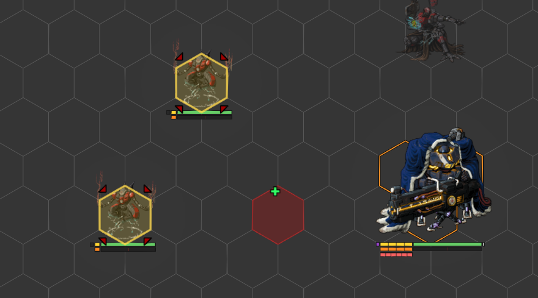
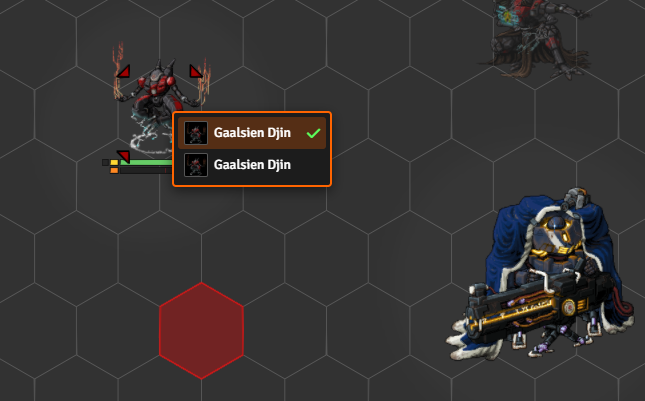
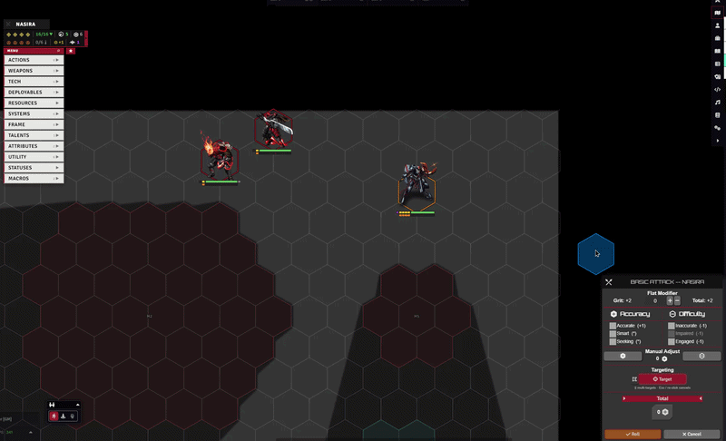
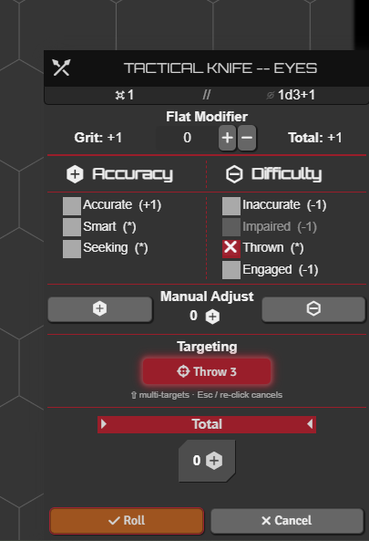
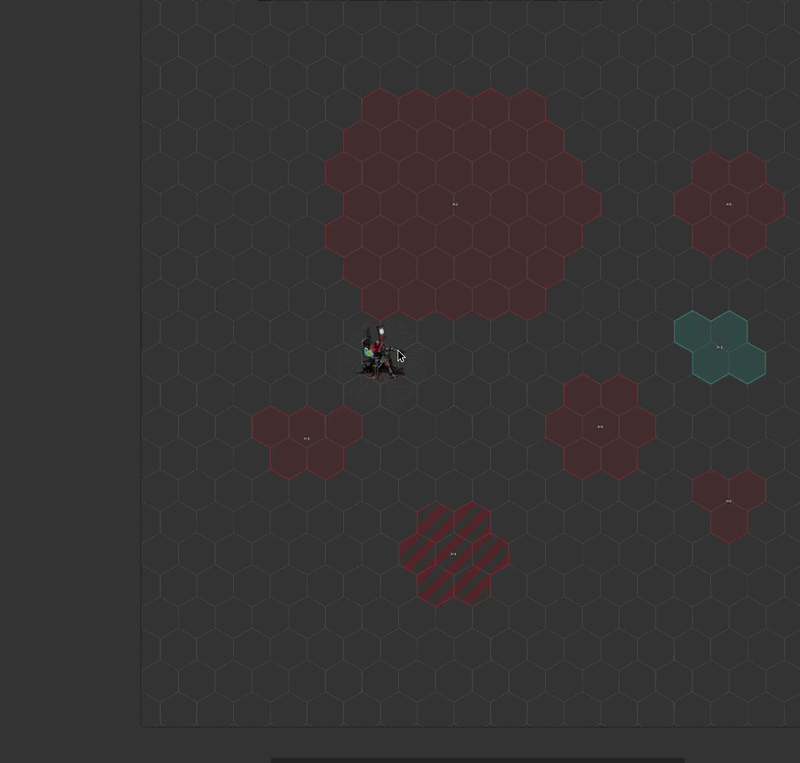
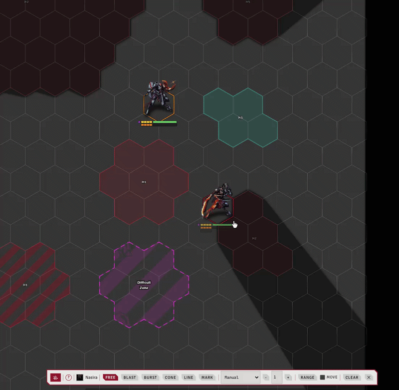

# Advanced Targeting and Measurement

[← Back to the README](../index.md)

With **`enableAttackTargeting`** on, the attack HUD gains a picker for choosing your target or placing your area straight from the accuracy/difficulty dialog. Whatever you pick becomes a normal Foundry target the roll reads as usual, and it clears again once the attack resolves.

Separately, a standalone **measure toolbar** (**Shift+R**) puts the same shapes, marks, and range readouts on the canvas any time - see [Advanced Measure tool](#advanced-measure-tool) below.

---

## Settings

**Combat & Movement → Combat Flows** (**`enableAttackTargeting`**, plus **`autoStartTargetPicking`** to open the picker the moment an attack starts with no target set). **`enableDamageTargeting`** puts the same picker on the damage HUD, hold Shift for multiple.

**`targetToolCursor`** and **`rulerToolCursor`** swap the cursor and play a sound while the Select Target and Measure Distance tools are active.

---

## The targeting buttons

When the attack HUD opens, a targeting button joins its range row. A simple-range weapon gets a **Range N** button, a tech attack gets **Sensors N**, and an AoE weapon gets one button per pattern, **Blast / Burst / Cone / Line**, in place of the system's template buttons, with an **Elevation aware / Auto elevation / Propagation** toggle row below them.

Click a button to start picking, click it again (or Esc) to stop.

 

---

## Single-target picking

The cursor highlights what's under it: blue over a token, red over empty ground. Click a token to target it, and hold **Shift** to keep targeting more. Esc or a re-click ends it. There's no range gate, the button's range is only a label.

 

Where tokens overlap, a small picker lists them to choose from.

 

---

## Hit chance and damage

Each targeted token gets a live **hit chance** and **damage range** label. **`targetInfoDisplay`** sets who sees them: **No**, **GM only** (default), or **GM and players**.

 

---

## Throwing

Tick a throwable weapon's **Thrown** box in the HUD and the button becomes **Throw N**, previewing the throw distance in place of the melee reach. Clear it to go back to the weapon's normal range. A weapon whose box is ticked but carries no Thrown tag keeps its normal range.

 

Rolling the attack then lands the weapon on the field as a token and disables it on the sheet until you [pick it back up](./INTERACTIVE_TOOLS.md). With **`enableThrowFlow`** on, attacking a throwable weapon first asks whether to attack with it or throw it.

 

---

## Area templates

Placing a template catches every token inside it as a target. **Blast** drops a disk on the hovered cell, **Burst** centers on the token under the cursor, and **Cone** and **Line** aim from the cursor and rotate with **Ctrl + mouse-wheel** (a line also tilts into a slope). Hold **Shift** while placing to stack more shapes onto the same target set.

 

---

## Elevation, auto-elevation, propagation

The toggle row controls the 3-D side. **Elevation aware** catches tokens by vertical overlap and lets tall terrain block the shape. **Auto elevation** sits the area on the Terrain Height Tools ground beneath it. **Propagation** floods the area out from its origin so it can't reach over terrain into a pocket behind. With all three off, the area is flat.

 

---

## Keybinds

**E / Q** raise and lower the area's elevation, **W / S** tilt a line, and **Ctrl + wheel** rotates a cone or line. All are rebindable under Configure Controls → Lancer Automations.

---

## After the roll

Closing the HUD stops the picker and clears its shapes, and once the attack resolves your targets are released automatically. Your in-progress aiming can also be shown to other players, see [Share Interactive Tools](./INTERACTIVE_TOOLS.md).

---

## Advanced Measure tool

Press **Shift+R** to toggle a standalone measure toolbar, docked above the macro hotbar. It's per-client and works outside any attack or flow. Pick a mode from the toolbar:

- **Free** - move and drag tokens as usual.
- **Shapes** - place a **Blast / Burst / Cone / Line** at a chosen size. Click to drop, click (or right-click) again to remove.
- **Mark** - drop single markers on the grid. Click or right-click one to remove it.
- **Range** - pulse the reference token's range on the canvas: threat, sensors, reach, weapon, or a manual radius. The reference is whatever you have selected.
- **Move** - the reference token's movement reach, in the ruler's speed tiers.

The **ruler** button toggles distance labels from the reference token, with a [line-of-sight](./VISION.md#lancer-line-of-sight) eye when Lancer LOS is on.

**Clear** wipes the current placements. The **✕** (or Shift+R again) closes the toolbar. Closing hides the marks and toolbar but keeps them, so reopening picks up where you left off.

Hover the **?** for the keybinds: Ctrl+wheel rotates, Shift+wheel resizes, Q/E shifts elevation, W/S tilts a line, and Escape stops placing.

Move mode works for one token or a whole selection at once:

