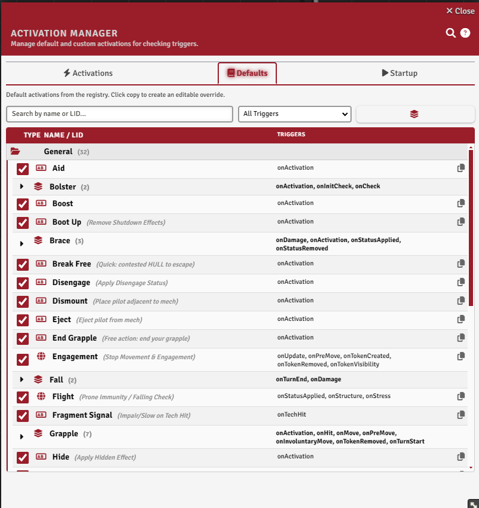
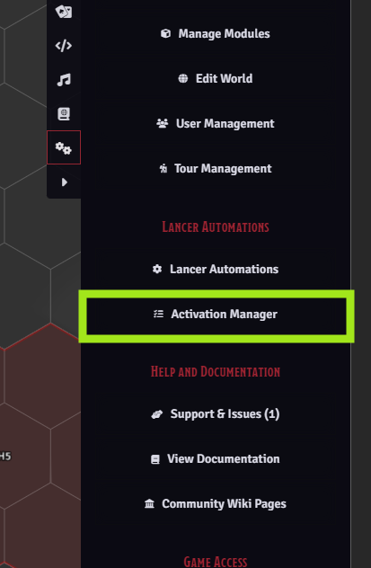
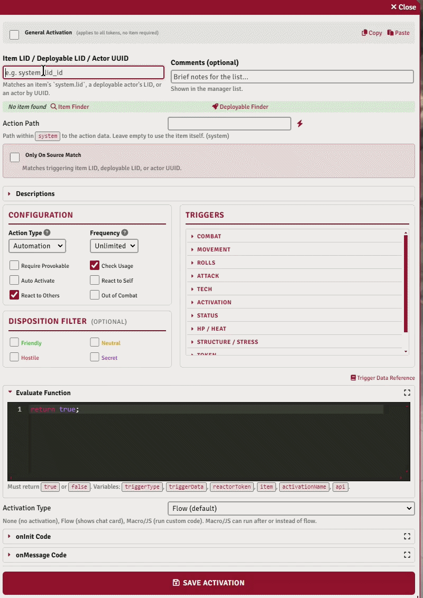
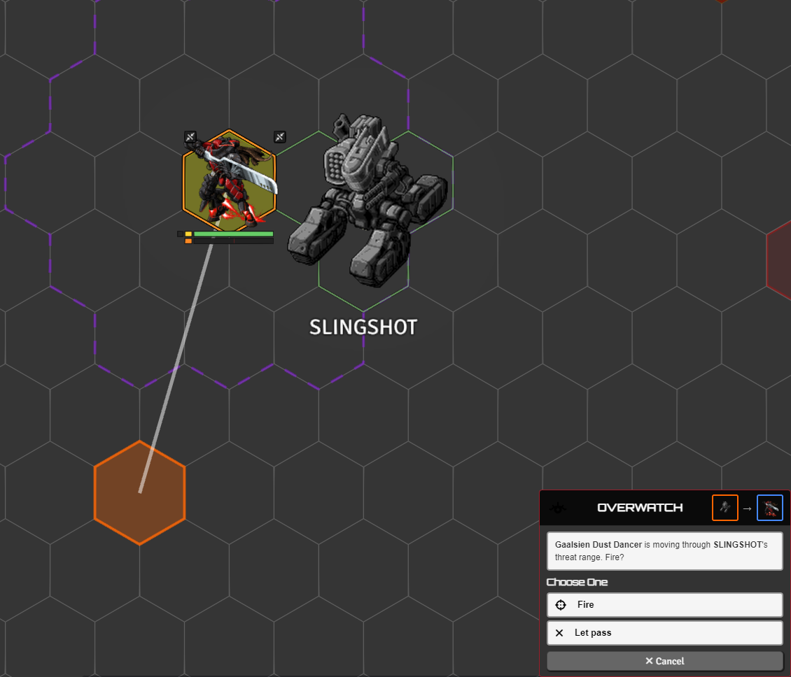
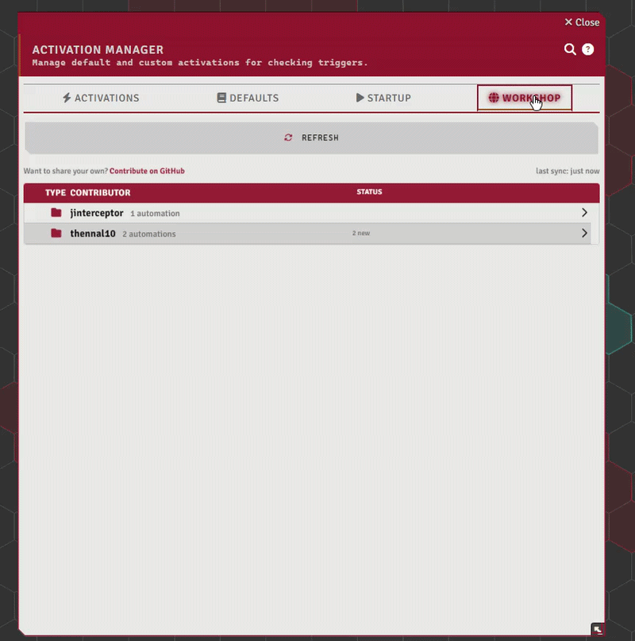
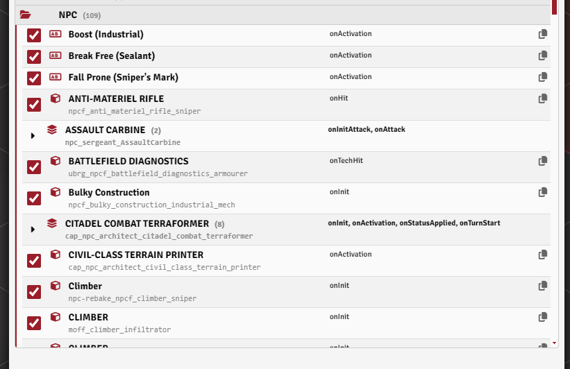

# Automation Engine

[← Back to the README](../index.md) · Engine internals: [AUTOMATION_SYSTEM.md](../AUTOMATION_SYSTEM.md) · API: [API_REFERENCE.md](../API_REFERENCE.md)



Automate almost any Lancer action.

Engine internals (full trigger list, evaluate / activation / onInit callbacks, cancel and modify, client and socket execution) are in **[AUTOMATION_SYSTEM.md](../AUTOMATION_SYSTEM.md)**.

---

## What's automated by default

Lancer Automations provides basic automation for most of the game's base actions. There's no ready-made automation for specific NPC or mech items yet. For those, it's up to you to build your own, and the Activation Manager is where you do it.

---

## The Activation Manager



Register, modify, and copy automations. Open it from the Lancer Automations settings.

It has two kinds of entries:

- **Item-based** automations are tied to a Lancer item by its LID. Only tokens that own that item can react. You can also bind one to a deployable LID, or to a specific Actor UUID, so it reacts only as that one exact actor instead of every actor with the item.
- **General** automations aren't tied to any item. Any token in the scene can react, filtered by the rules you set.

Entries can be sorted into named **folders**, and there's a **Startup Scripts** tab, covered further down.

Each activation has an **enable / disable** toggle. It works per sub-reaction on a multi-reaction item, and on the built-in and personal-set automations too (the toggle is saved as your own override, so disabling a built-in one sticks).

<br clear="right"/>

### Changing a built-in automation

You can't edit a built-in directly. Three ways around it:

| Want | Do |
|------|----|
| Turn it off | The **enable toggle**. Saved, so updates don't undo it. |
| Change it | **Edit** it. Your version is saved over the default. |
| Make a variant | **Copy to Custom** (copy icon on the row). Makes an editable copy and opens it. The original stays. |

To replace a built-in: copy it, edit the copy, disable the original.

All of this is saved in your world, not the module, so updates never overwrite it. **Export / Import** moves it to another world.

<br clear="right"/>

### Finding an item's LID


Item-based automations need the item's LID. The **LID finder** on the Item tab browses your world and compendium items so you can search and copy a LID, and see the action paths inside it. A deployable can be set to react to its own deploy (the `onDeploy` trigger), covered in [AUTOMATION_SYSTEM.md](../AUTOMATION_SYSTEM.md).

<br clear="right"/>

---

## Configuring an activation



Each activation is a small form. The main fields:

| Group | What you set |
|-------|--------------|
| **Triggers** | Which game events fire it (`onMove`, `onHit`, `onActivation`, `onDeploy`, and many more). Full list in [AUTOMATION_SYSTEM.md](../AUTOMATION_SYSTEM.md). |
| **Mode** | How it composes with the original action: **instead of** or **after** it, and whether it **auto-activates** silently (no popup). |
| **Filters** | Disposition (Friendly / Hostile / Neutral, plus Token Factions teams), trigger-self / trigger-other, only-on-source-match, require-can-provoke, and out-of-combat. |
| **Binding** | What the automation attaches to: an item LID, a deployable LID, or an Actor UUID, plus an action path to bind one sub-action, the action type shown in the popup (Reaction / Quick / Full / ...), and frequency. |
| **Text** | Override the trigger and effect descriptions shown in the popup. |

### Example: react to your own activation

The smallest useful activation: run your own code when an item's action is used. Exported, a self-reacting `onActivation` looks like this (this one shows a notification):

```json
{
  "isGeneral": false,
  "lid": "mf_balor_alt_hecatoncheires",
  "name": "",
  "reaction": {
    "triggers": ["onActivation"],
    "evaluate": "return true;",
    "actionType": "Quick Action",
    "frequency": "Unlimited",
    "autoActivate": true,
    "triggerSelf": true,
    "triggerOther": false,
    "outOfCombat": true,
    "onlyOnSourceMatch": false,
    "activationType": "code",
    "activationMode": "instead",
    "activationCode": "ui.notifications.info(\"The Action of this frame is activated\");",
    "reactionPath": "core_system.passive_actions[0]"
  }
}
```

What makes it self-react on use:

- **`triggers: ["onActivation"]`** - fires when the item's action runs.

- **`triggerSelf: true`** (with `triggerOther: false`) - the acting token is the reactor, so it reacts to its own action. There is also `triggerTarget: true` - the reactor is one of the event's targets (the one being attacked), usable with both others off for target-only reactions.

- **`autoActivate: true`** - runs silently, no popup.

- **`activationMode: "instead"`** - your code runs alone. `"after"` also fires the reaction's own flow/card alongside it; neither touches the flow that triggered you.

- **`reactionPath: "core_system.passive_actions[0]"`** - binds to one specific action (here a frame's first core passive). Swap the `lid` and `reactionPath` for your own item and action. Drop `reactionPath` to bind the whole item.

---

## How an activation runs



When a trigger fires and the filters pass, three pieces decide the outcome.

**Activation type** sets *what* runs: your own **code**, the item's normal **flow**, a **macro**, or **none**.

**The evaluate function** runs first, as a final check. Return `true` to go ahead, `false` to skip. Use it for conditions the filters can't express, like "only if the target is below half HP" or "only if the attacker is flying".

**The activation code** is the effect itself, run when the automation fires. It has access to the full `api` (apply effects, move tokens, place zones, show choice cards, etc.).

There's also an **onInit** block that runs once when a token is created, for passive setup like constant bonuses or auras.

You write these as plain function bodies, or full functions (the wrapper is stripped for you). The exact arguments each block receives, the order filters run in, and the synchronous rule for cancel and modify triggers are in [AUTOMATION_SYSTEM.md](../AUTOMATION_SYSTEM.md).

By default `onActivation` fires when an item runs through an activation. **`treatGenericPrintAsActivation`** also fires it for items printed via Lancer's generic print.

### Debugging what you get

Call **`#!js triggerData.debugActivation()`** inside `evaluate` or `activationCode` to dump that call to the console: the trigger type, the reactor token, the item, the activation name, every field on `triggerData`, and the list of helper functions available for that specific trigger. Pass a label (`#!js debugActivation("before the check")`) to name the group when you have several.

It returns the same information as an object, and it's also on the api as `#!js api.debugActivation(triggerType, triggerData, reactorToken, item, activationName, label)`.

This is the fastest way to find out what a trigger actually hands you instead of guessing from the docs.

---

## The activation popup


When a trigger fires reactions that aren't set to auto-activate, they're collected into a popup, grouped by token. Click an entry to expand its detail panel (trigger text, effect, action type badge, frequency), then click **Activate** to run it.

- Who sees the popup depends on the **`reactionNotificationMode`** setting: the token's owner, the GM, or both.
- **Right-click** a reaction to open its source item's sheet.
- If more reactions trigger while a popup is open, a small **pending badge** shows how many are queued behind it.

<br clear="right"/>

---

## Reaction economy

If **`consumeReaction`** is on, activating a reaction spends that token's reaction for the round. The popup shows the reaction as unavailable once it's spent.

---

## Startup scripts


The **Startup Scripts** tab in the Activation Manager holds code that runs once when Foundry is ready, before play starts. The main use is registering helper functions with `api.registerUserHelper`, callable from any activation or macro.

The registration patterns are in [API_HOWTO.md](../API_HOWTO.md).

<br clear="right"/>

---

## Sharing automations

**Copy** / **Paste** in the activation editor moves one activation. **Export Pack** / **Import Pack** in the Activation Manager moves a bundle of activations and startup scripts as `la-pack-<name>.json`, with a summary to pick what applies.

The [Workshop](https://github.com/Agraael/Lancer-automations-workshop) is where people share those files. The **Workshop** tab in the Activation Manager browses and imports it directly; re-importing a file updates your copy instead of duplicating it.



---

## The personal activation set

Module Settings has a toggle for my personal activation set (**`enableLaSossisItems`**): 30+ of my own item automations, with examples like Dispersal Shield, Marker Rifle, and Defense Net. Once enabled, they show in the Activation Manager under the **default** section.

> [!NOTE]
> This is **my own stuff, not part of the core module**. It's literally the automations I built for my own games (my NPCs, my items), shared as-is. It isn't a complete or general library, and it won't automate your content. Treat it as a set of examples to learn from, not something to rely on.

The worked examples are walked through in [NPC_EXAMPLES.md](./NPC_EXAMPLES.md), and the patterns for registering your own automations from code are in [API_HOWTO.md](../API_HOWTO.md).

Some of these deployables aren't in any official LCP. If a personal activation spawns one that won't resolve, import the small companion pack that ships with the module: [`extra/LaSossis_Npc_Deployables.lcp`](https://github.com/Agraael/lancer-automations/blob/main/extra/LaSossis_Npc_Deployables.lcp).


