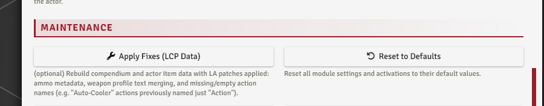

# System Additions

[← Back to the README](../index.md)

A few changes Lancer Automations makes to the Lancer system and its sheets.

---

## Item Disabled

Right-click a mech weapon, mech system, NPC feature, or weapon mod on its sheet to **disable** it. A disabled item dims with a power-off icon and is blocked from every attack and activation flow. A Full Repair clears the flag.

The throw-weapon automation uses it to disable a weapon while it's out on the field.

 

---

## Ammo

The module surfaces each of a system's **ammo** entries on its sheet with a one-click **USE**.

 

A system's ammo is set up on its item sheet. The **Apply Fixes (LCP Data)** tool backfills official ammo descriptions and restriction data onto items that ship without them.

 

---

## Extra status effects

**Guardian**, **Bulwark**, **Phasing**, and **Infection** are always registered. The **`additionalStatuses`** toggle (Statuses & FX tab) adds around seventeen more beyond Lancer's defaults, like Immovable, Throttled, Climber, Brace, Dazed, Resist All, and Aided.

These are mine and predate the module by years: states LCPs and alternate structure tables describe but never register as statuses. Safe to leave off, automations that use them just skip.

Some carry mechanics:

- **Resist All** sets every resistance
- **Shredded** zeroes armor + resistances
- **Throttled** pre-checks Half Damage on the damage card
- **Phasing** moves through other characters in pathfinding and knockback, but can't end its movement on them
- Dead Rings LCP: **Stripped** zeroes armor, **Staggered** locks actions

 

---

## Permanent statuses

A status whose duration is set to **permanent** (in the [Effect Manager](./EFFECTS_AND_BONUSES.md)) survives a Full Repair.

---

## Extra trackable attributes

The module exposes **move** and **reaction** from the action tracker, plus **infection**, as token resource-bar options in the Token Config Resources tab.

---

## Self-heat resistance

With **`resistSelfHeat`** on (Combat tab, default on), a mech that resists Heat takes half of its own self-inflicted heat.

With **`convertHeatToEnergyOnHeatless`** on (default on), Heat damage becomes Energy against targets with no heat capacity (pilots, biological NPCs), the way Lancer already does for pilots.
