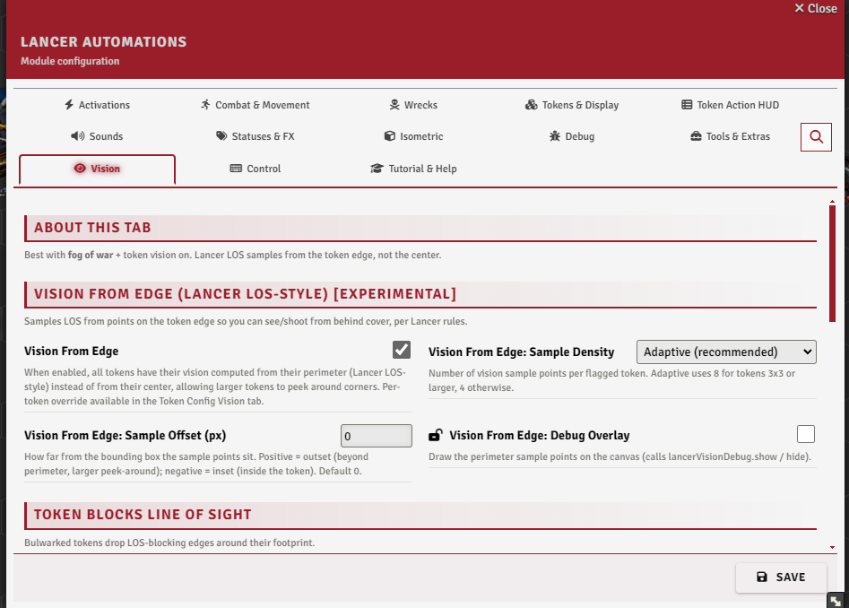
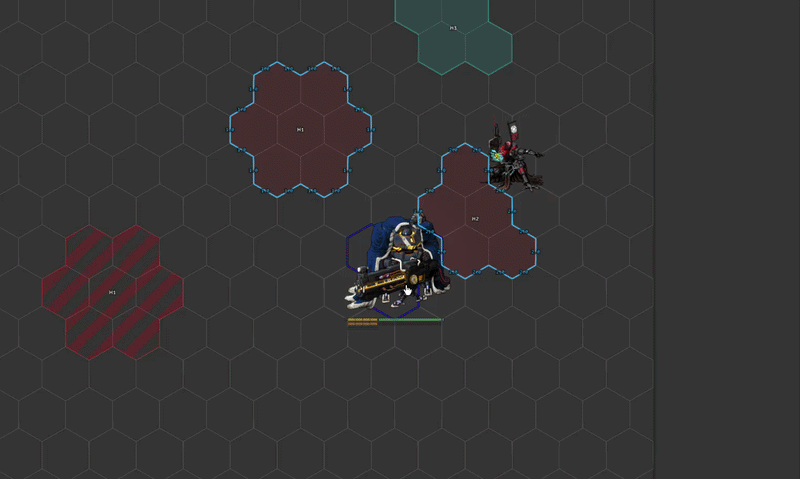
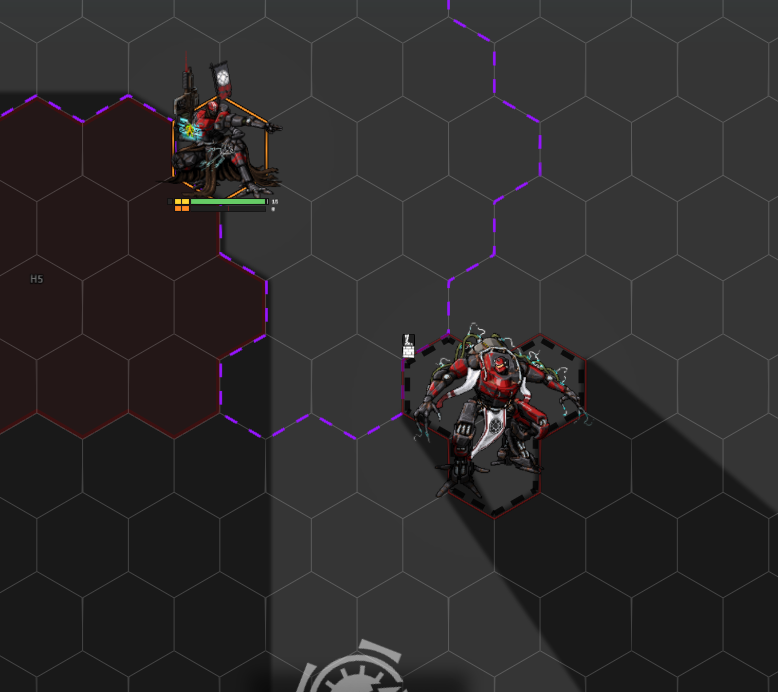
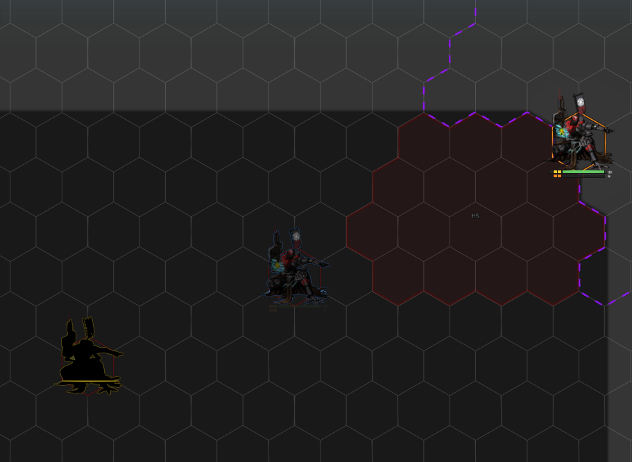

# Vision

[← Back to the README](../index.md)

Lancer has no fog of war or vision, but these tools bring it closer to its rules: line of sight sampled from the token's edge, tokens that block sight, and Sensor / Battlefield Awareness detection modes. They work best with fog of war and token vision turned on.

---

## Settings

The **Vision** tab.

 

---

## Lancer line of sight

**`lancerLos`** emulates Lancer's line-of-sight rules: a token behind a wall stays visible if another token can see it. The result is accurate, but it stays mostly visual for now, since there's no integrated tool to use it in play. Turn on **`lancerLosDebug`** to see how it resolves.

It calculates from walls, so it works with walls you place by hand and with walls generated from terrain by Terrain Height Tools. That's also why [tokens that block sight](#token-blocks-line-of-sight), Bulwark included, count here: they act as walls.

From code, [`hasLineOfSight`](../API_SPATIAL.md#line-of-sight) runs the same test.

 

---

## Vision from edge

Experimental. Vanilla Foundry checks line of sight from a token's center. **`visionFromEdgeEnabled`** instead samples it from points around the token's perimeter, so a large token can see and be seen around a corner. A per-token override lives in the Token Config Vision tab.

Tune it with the **sample density** (`visionFromEdgeSampleMode`: 4 corners, 8 perimeter, or adaptive) and the **sample offset** (`visionFromEdgeSampleOffset`, how far outside the token the points sit). **`visionFromEdgeDebug`** draws the sample points on the canvas. With Wall Height, the samples respect elevation barriers.

 

---

## Token blocks line of sight

A token can be set to **block line of sight** through its footprint, from a checkbox in its Token Config Vision tab. The **Bulwark** status turns this on automatically (`bulwarkBlocksLineOfSight`).

With **Wall Height** installed it's elevation-aware: the blocking edge sits slightly below the token's own height, so a token can see over another of the **same height** but not over a taller one.

 

---

## Token height (Wall Height)

For the elevation-aware blocking above to work, tokens need a height. **Auto Token Height** (`autoTokenHeight`, in the Token Display settings) sets each token's Wall-Height height to its size, so it peeks over walls and tokens of its own size.

**`autoTokenHeightVehicleSquad`** lowers that for vehicles and squads (my own interpretation of their heights, not an official rule), and a **Sync All Token Heights** button writes it onto every existing actor and token at once.

---

## Lancer vision modes

Two detection modes, auto-added to tokens on creation (`lancerVisionAutoAdd`):

- **Sensors** - blue scanlines, ranged to the actor's `sensor_range`, a precise read of who's on sensors.
- **Battlefield Awareness** - a fuzzy yellow silhouette at infinite range, for "you know something's there."

When both could see a target, **Sensors win**. Either can be limited to combat (`lancerSensorCombatOnly` / `lancerAwarenessCombatOnly`) or read its range from the token's detection-mode entry (`...UseModeRange`).

A per-token **Detection Visual** (Token Config) sets how a token reads: **Default**, **Simple Object**, **Visible**, or **Ignore** - any non-default also turns Sensors off for it.

**`basicSightTo999`** gives new tokens full basic sight, and **Refresh Tokens** re-applies the modes across scenes and actors.

 

---

## Drag vision

While a token is dragged, its vision can be shrunk so you don't reveal new map as you move. **`dragVisionMultiplier`** sets how much (1 = full, 0 = none), read as a ratio of the current radius or a flat range depending on **`dragVisionMode`**.

---

## Performance

Recomputing vision is expensive. Two toggles ease that on busy scenes:

- **`visionAnimationThrottleFps`** caps how often vision and light refresh while a token is moving (0 = vanilla).
- **`disableVisionAboveControlled`** turns token vision off while more than N tokens are selected at once (0 = never), so batch-selecting doesn't recompute every token's sight.
