<div class="la-banner-wrap"><pre class="la-banner">██╗      █████╗ ███╗   ██╗ ██████╗███████╗██████╗                                            
██║     ██╔══██╗████╗  ██║██╔════╝██╔════╝██╔══██╗                                           
██║     ███████║██╔██╗ ██║██║     █████╗  ██████╔╝                                           
██║     ██╔══██║██║╚██╗██║██║     ██╔══╝  ██╔══██╗                                           
███████╗██║  ██║██║ ╚████║╚██████╗███████╗██║  ██║                                           
╚══════╝╚═╝  ╚═╝╚═╝  ╚═══╝ ╚═════╝╚══════╝╚═╝  ╚═╝                                           
                                                                                             
 █████╗ ██╗   ██╗████████╗ ██████╗ ███╗   ███╗ █████╗ ████████╗██╗ ██████╗ ███╗   ██╗███████╗
██╔══██╗██║   ██║╚══██╔══╝██╔═══██╗████╗ ████║██╔══██╗╚══██╔══╝██║██╔═══██╗████╗  ██║██╔════╝
███████║██║   ██║   ██║   ██║   ██║██╔████╔██║███████║   ██║   ██║██║   ██║██╔██╗ ██║███████╗
██╔══██║██║   ██║   ██║   ██║   ██║██║╚██╔╝██║██╔══██║   ██║   ██║██║   ██║██║╚██╗██║╚════██║
██║  ██║╚██████╔╝   ██║   ╚██████╔╝██║ ╚═╝ ██║██║  ██║   ██║   ██║╚██████╔╝██║ ╚████║███████║
╚═╝  ╚═╝ ╚═════╝    ╚═╝    ╚═════╝ ╚═╝     ╚═╝╚═╝  ╚═╝   ╚═╝   ╚═╝ ╚═════╝ ╚═╝  ╚═══╝╚══════╝</pre></div>

[](https://github.com/Agraael/lancer-automations/releases/latest)

<br/>
[)](https://github.com/Agraael/lancer-automations/releases/latest)
[)](https://github.com/Agraael/lancer-automations/releases/latest)

[](#)
[](#)


<details markdown="1">
<summary>patreon...</summary>

Well, project became bigger, now there's more people. So the Patreon is starting to get real. If you wanna support my late nights, that's here.

In any case, my stuff would always be free, and if I stop working on it, I'll just close that thing. [Patreon](https://www.patreon.com/cw/LaSossis)

</details>

Check out my other modules and tools: [List of stuff](https://www.patreon.com/posts/list-of-stuff-149377511)

---

Welcome to Lancer Automations. What began as a tiny Lancer QoL tweak for my own games grew into something much bigger: a way to play Lancer on Foundry VTT with a layer of automation, UI, and quality-of-life on top.

It keeps growing and taking on its own identity, and one day it might even outgrow the Lancer system entirely, so think of it less as a set of toggles and more as a game engine.

At its heart is an automation engine that can automate almost any item from any LCP, plus a large toolbox for picking tokens, spawning tokens, handling network messages, asking players for choices, and much more.

A lot of it weaves right into the interface, so if you aren't deep in the Lancer Foundry ecosystem you might assume some of these features are vanilla. They aren't, they just feel like they were always part of Lancer.

<p align="center">
  
</p>

A heads-up: not all of it is built to be fully customizable, a lot is just how I see the game. A game for everyone is a game for no one, and Lancer Automations will shape how you play. Once you're in, it's hard to leave, so be careful.

<details markdown="1">
<summary><h2>⚠️ Please read before you install ⚠️</h2></summary>
<br>

> **First of all, I really recommend reading the feature guides.** I know it's a lot, a lot, but trust me, it's important.
>
> This is a dense, heavy module, closer to a game-system extension than a simple add-on, with built-in takes on popular modules (Token Action HUD, Lancer QoL, Bar Brawl, and more). You should already know Foundry and Lancer well. If you're new to Foundry, get comfortable there first or you risk losing a lot of time.
>
> **The default setup is more than enough for most Lancer GMs.** If you write your own activations and get stuck, ask me on Discord.
>
> **It does not (yet) provide full item and NPC automation.** Some items and simple NPC automations are built in, that's it for now. The optional personal activation set is my own automations for my own games, shared as-is, not part of the core module.
>
> **Docs are split in two:** feature guides for what a feature does and how to reach it, `doc/API_*.md` for the code side. The very latest additions land first on my [Patreon](https://www.patreon.com/cw/LaSossis), with illustrations.
>
> **Before asking questions**, explore and try stuff first. It's a lot easier on me if I don't have to answer the same obvious questions, and it may be that I just haven't documented it yet. Thanks.

</details>

## Where to reach me

The most common spot is [my channel](https://discord.com/channels/426286410496999425/1436087781666455642) on the [Pilot NET Discord](https://discord.com/invite/lancer).

## Workshop

[Lancer Automations Workshop](https://github.com/Agraael/Lancer-automations-workshop) is where people share the automations they made, and grab other people's. You get a folder named after your GitHub account, and a bot merges the pull request as long as you only changed your own folder. Anything about writing or sharing automations goes in the [workshop channel](https://discord.com/channels/426286410496999425/1537081666483527690).

## Community guides

These are guides on how to play with Lancer Automations, from the Korean community. They're pretty good, check them out:

- Part 1 - UI & Movement: [Korean Guide](https://arca.live/b/trpg/178385275)
- Part 2 - Attacks & Reactions: [Korean Guide](https://arca.live/b/trpg/178478271)

## 📘 [Read the full API reference →](API_REFERENCE.md)

Trigger schemas, function signatures, every option. Split across `doc/API_*.md` (Combat, Effects, Interactive, HowTo). Start there if you're writing activation code, macros, or hooking the engine from another module.

---

## Installation

In Foundry, go to **Add-on Modules → Install Module**, paste this into the **Manifest URL** field at the bottom, and hit Install:
```
https://github.com/Agraael/lancer-automations/releases/latest/download/module.json
```

### Required

| Module | Description |
|--------|-------------|
| [Lancer System](https://foundryvtt.com/packages/lancer) | The Lancer RPG system for FoundryVTT, v3.0.0 or newer |
| FoundryVTT v13.351+ | The version I'm currently working on |
| [Lancer Style Library](https://github.com/Agraael/lancer-style-library) | Shared UI components and styling |
| [Temporary Custom Statuses](https://github.com/Agraael/temporary-custom-statuses) | Custom status effects with stacking |
| [lib-wrapper](https://github.com/foundryvtt/lib-wrapper) | Required for API hooks |
| [Socketlib](https://foundryvtt.com/packages/socketlib) | Required for API hooks |
| [Token Magic FX](https://foundryvtt.com/packages/tokenmagic) | Required for API hooks |
| [Sequencer](https://foundryvtt.com/packages/sequencer) | Required for API hooks |
| [JB2A - Patreon](https://www.patreon.com/JB2A) **or** [JB2A - Free](https://foundryvtt.com/packages/JB2A_DnD5e) | Source of most action FX visuals. Patreon is preferred since it has the full library. The free pack works too: missing assets are auto-swapped to free equivalents, sometimes recolored, so a few effects look a bit rougher. |

### Optional

| Module | Why you'd want it |
|--------|-------------------|
| [CodeMirror](https://github.com/League-of-Foundry-Developers/codemirror-lib) | Syntax highlighting in the evaluate/activation code editors |
| [TemplateMacro](https://github.com/Agraael/templatemacro) | Required for zone placement tools (effect zone, dangerous zone, difficult terrain) |
| [Status Icon Counter](https://foundryvtt.com/packages/statuscounter) | Shows stack counts on effect icons |
| [Token Factions](https://github.com/p4535992/foundryvtt-token-factions) ([my fork](https://github.com/Agraael/foundryvtt-token-factions)) | Original module for token border coloring by disposition. My fork adds an advanced multi-team disposition matrix, for more than two sides |
| [Grid-Aware Auras](https://github.com/Wibble199/FoundryVTT-Grid-Aware-Auras) (or [my fork](https://github.com/Agraael/FoundryVTT-Grid-Aware-Auras)) | Required for the `createAura` and `deleteAuras` API functions |
| [Terrain Height Tools](https://github.com/Wibble199/FoundryVTT-Terrain-Height-Tools) (or [my fork](https://github.com/Agraael/FoundryVTT-Terrain-Height-Tools)) | 3D terrain height painting and line-of-sight calculation |
| [Lancer Weapon FX](https://github.com/BoltsJ/lancer-weapon-fx) | Visual/audio effects on attacks and built-in action animations (Boost, Hide, Shut Down, Fall, Overcharge, etc.) |
| [Wall Height](https://foundryvtt.com/packages/wall-height) | Required for elevation-aware Token Blocks Line of Sight (Bulwark / per-token blocker): walls inherit the token's height, letting same-height observers peek over. Without it, blocking is purely 2D. |
| [Force Client Settings](https://gitlab.com/kimitsu_desu/force-client-settings) | Push client-scoped settings to all your players, so your whole table shares one config. |

### Recommended

| Module | Description |
|--------|-------------|
| [Lancer NPC Import](https://github.com/Agraael/Lancer-vtt-NPC-import-Macro) | Bulk NPC import from LCP JSON, Comp/Con v3 cloud sync for pilots, pilot import with reserves/projects/organizations. |
| [Actor Browser (fork)](https://github.com/Agraael/vtt-actor-browser-fork) | Browse and search actors across folders and compendiums with filtering and drag-and-drop. |

---

## Settings

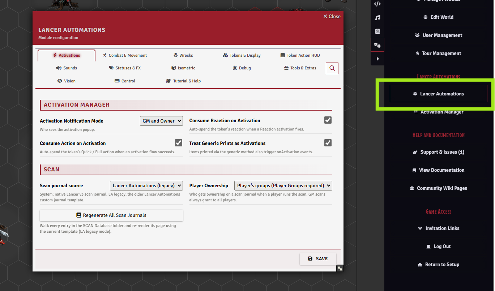

Almost everything in the module is configured from one place: **Game Settings > Configure Settings > Lancer Automations**.

Every feature has its toggles here, and a handful of buttons open dedicated tools: the Activation Manager, export and import, the guided tour, the news popup, and a full reset.

There are a lot of settings, so they aren't all listed here. Each feature guide explains the ones that matter for it, and every setting has an inline hint.

> [!TIP]
> Go through the settings before your first session and set a baseline. The module is largely opt-in. Many settings are client-scoped (per player), so use Force Client Settings to apply your setup to the whole table.

### Export & Import

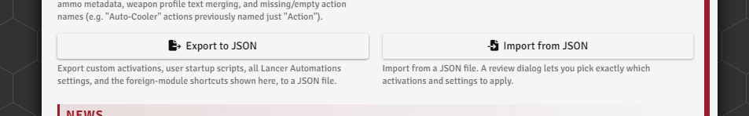

Export your whole setup (automations, startup scripts, settings, and keybindings) to a JSON file for a backup or to share a build, then import it back through a review dialog that lets you pick exactly what comes in.

A full reset is here too.

<br clear="right"/>

---

## Feature guides

Short pitches below. Each links to its full guide.

### Automation Engine

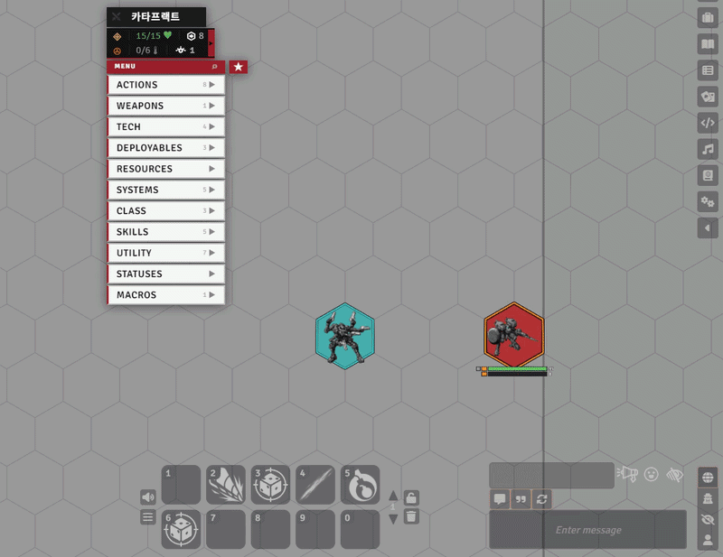

The core feature of Lancer Automations, and the hardest to grasp. The engine automates almost any item, effect, or event tied to Lancer gameplay.

Many of Lancer's base actions, plus some items and simple NPC automations, are handled by default.

I also ship my personal set of activations, but that's separate: just my own games' stuff shared as-is, not part of the core module, there for you to use, inspect, or modify to dip your toes into the engine.

→ Full guide: [`doc/feature/AUTOMATION_ENGINE.md`](feature/AUTOMATION_ENGINE.md) ・ engine internals: [`doc/AUTOMATION_SYSTEM.md`](AUTOMATION_SYSTEM.md) ・ worked examples: [`doc/feature/NPC_EXAMPLES.md`](feature/NPC_EXAMPLES.md)

<br clear="right"/>

---

### Effect Manager & Bonuses

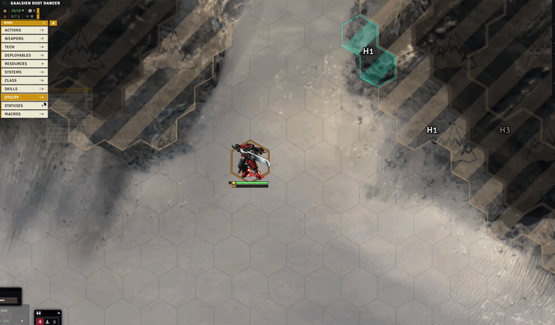

The Effect Manager can be driven from automation code through the API, but it's also fully available by hand during play.

It manages effects, custom effects, and many bonuses and status effects so you can apply almost anything you want: custom effects that grant charges, weapon range bonuses, a single reroll, and more.

→ Full guide: [`doc/feature/EFFECTS_AND_BONUSES.md`](feature/EFFECTS_AND_BONUSES.md)

<br clear="right"/>

---

### Token Action HUD

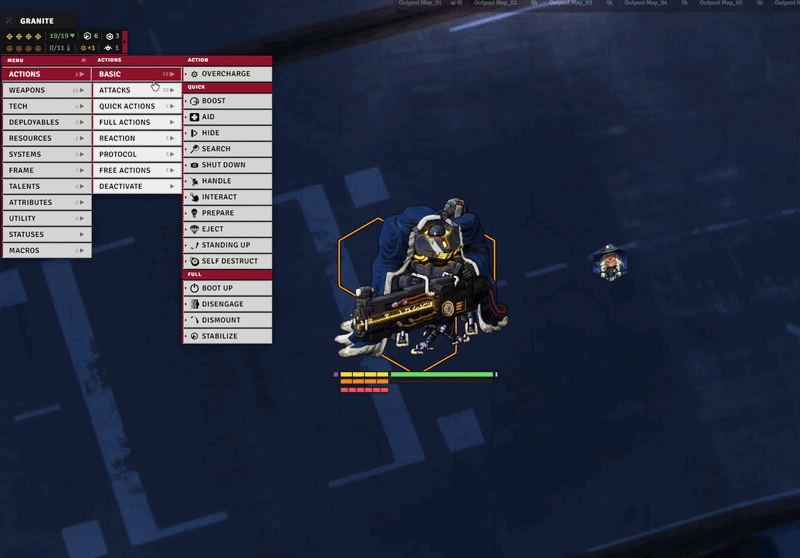

The TAH, or Token Action HUD, is a custom-built action menu attached right to your token: your items, skills, stats, scans, history, favorites, a search tool, range preview, and more.

→ Full guide: [`doc/feature/HUD.md`](feature/HUD.md)

<br clear="right"/>

---

### Custom Token Stat Bars

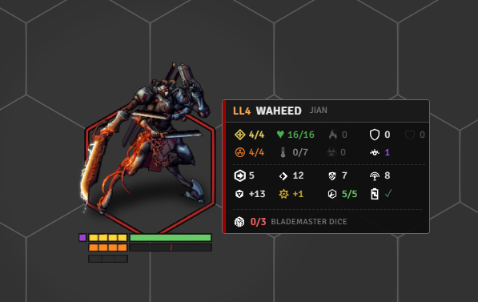

Lancer Automations draws its own token bars, tailored to Lancer and meant to replace Bar Brawl (turn Bar Brawl off on your tokens for these to show).

They show the stats that matter, with per-token control over when they're visible (in combat, out of combat, hidden, GM only, owner only), icon scale, and row height.

You can add extra custom bars per token, and talent counters can be injected automatically.

→ Full guide: [`doc/feature/TOKEN_DISPLAY.md`](feature/TOKEN_DISPLAY.md)

<br clear="right"/>

---

### Movement & the Lancer Ruler

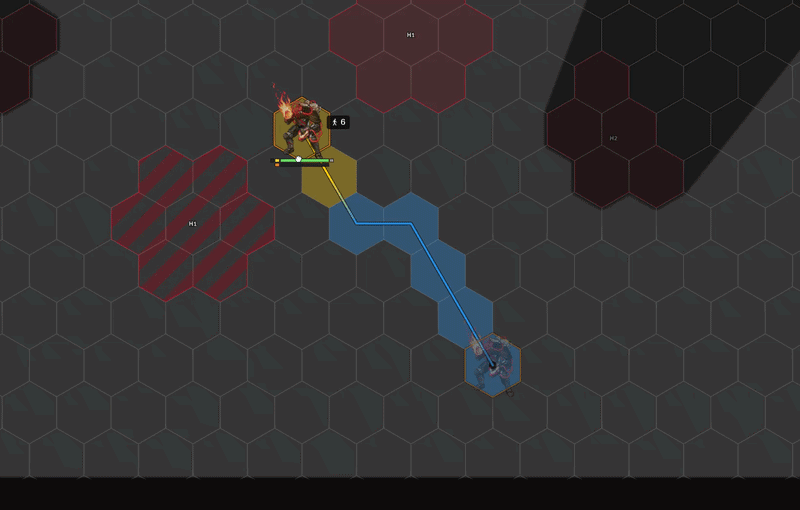

Lancer Automations ships its own Lancer ruler, built to be as detailed as possible.

There's still more work to do, but if you want accurate, detailed information about movement in Lancer, this ruler is for you.

The same system powers boost detection, cancelling movement through engagement, and more, all wired into the automation engine.

→ Full guide: [`doc/feature/MOVEMENT.md`](feature/MOVEMENT.md) ・ advanced/beta: [`MOVEMENT_ADVANCED.md`](feature/MOVEMENT_ADVANCED.md)

<br clear="right"/>

---

### Isometric handling

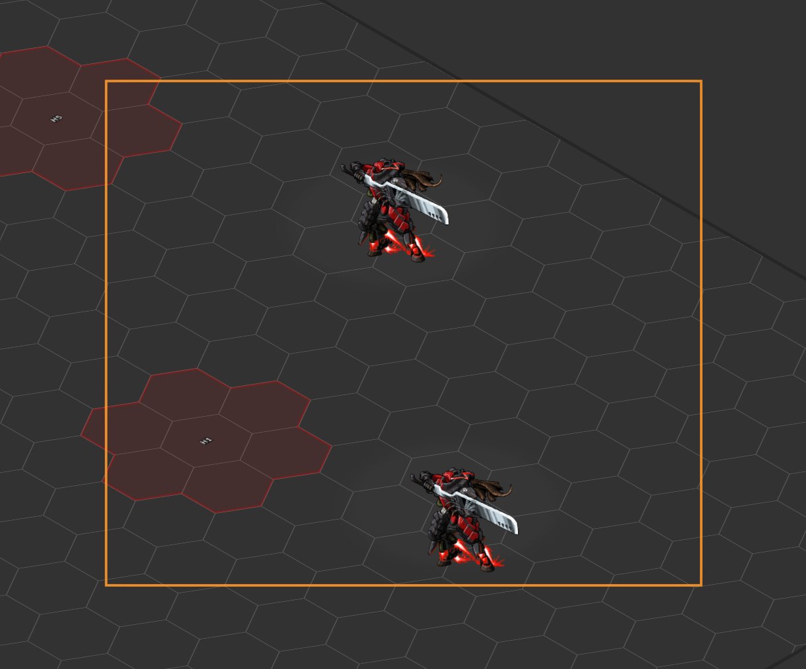

If you run an isometric game, Lancer Automations plays nicely with the isometric modules.

It animates token elevation in iso view and adapts its own UI (stat bars, tactical distance labels, waypoint labels, the target reticle, click zones, the selection marquee, scrolling text, and more) so the module's additions line up correctly in an isometric scene.

Each piece can be toggled from the Isometric settings tab.

Fair warning though: the module keeps growing, and these isometric adaptations aren't enough to cover all of it. In time Lancer Automations will need every visual feature brought fully into 3D, and that's a long road.

Honestly, I don't play isometric myself, so it's lower on my priority list for now. What exists works, but some features built to handle 3D elevation on a flat grid don't have an isometric counterpart yet.

→ Full guide: [`doc/feature/ISOMETRIC.md`](feature/ISOMETRIC.md)

<br clear="right"/>

---

### Interactive Tools

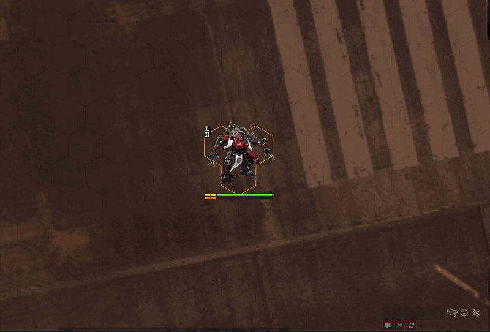

Interactive tools are meant to be used with the automation engine, and elsewhere too.

Lancer Automations provides many of them to build multi-step actions: applying knockback, choosing targets, picking tokens within a defined range, spawning tokens, running votes, and more.

→ Full guide: [`doc/feature/INTERACTIVE_TOOLS.md`](feature/INTERACTIVE_TOOLS.md)

<br clear="right"/>

---

### Advanced Targeting and Measurement

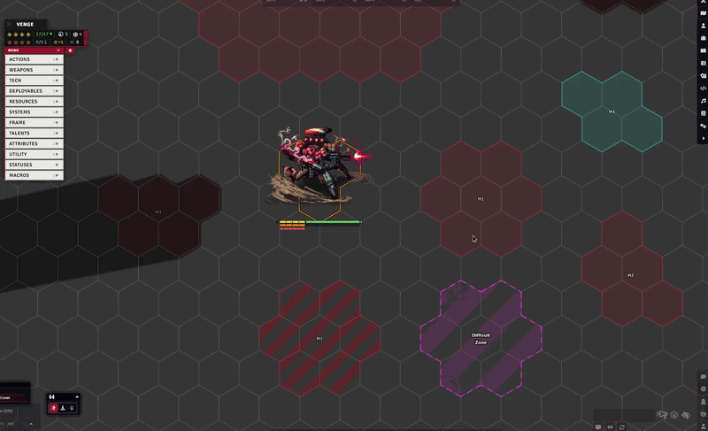

An upgrade to the Lancer system's targeting flow: choose your target or place a blast, cone, or line from the attack HUD, with 3D targeting, elevation and terrain blocking through Terrain Height Tools, adjustable line angles, and multi-targeting.

→ Full guide: [`doc/feature/ATTACK_TARGETING.md`](feature/ATTACK_TARGETING.md)

<br clear="right"/>

---

### Gameplay Automation

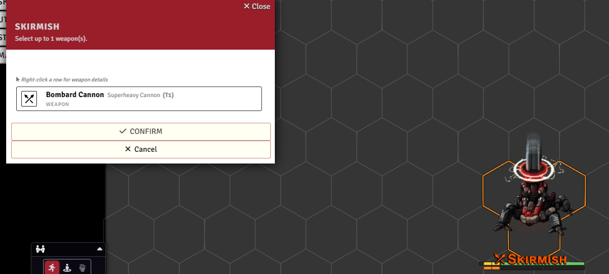

Through the automation engine and many tweaks to the Lancer system, Lancer Automations runs Lancer's actions and reactions for you, from combat to the out-of-combat flows: scanning, rest, downtime, and reserves.

It also handles skill checks and contests, and tracks usage per turn, per round, or per scene.

→ Full guide: [`doc/feature/GAMEPLAY_AUTOMATION.md`](feature/GAMEPLAY_AUTOMATION.md)

<br clear="right"/>

---

### FX and Sounds

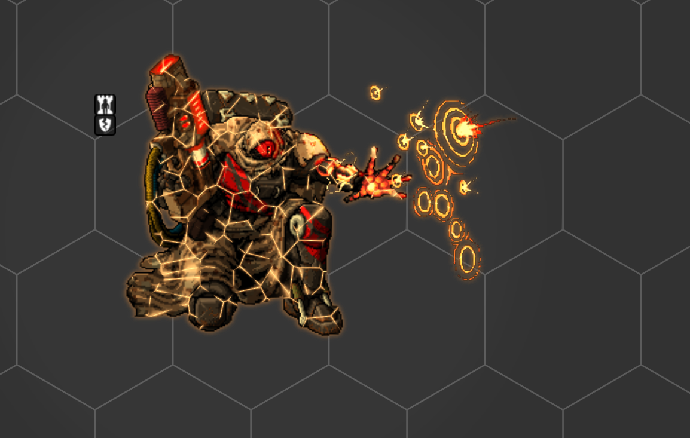

There's more flavor in Lancer Automations than just JB2A and Lancer Weapon FX.

Sounds and graphical effects run throughout the module, and almost all of them can be tweaked or disabled.

→ Full guide: [`doc/feature/FX_AND_SOUNDS.md`](feature/FX_AND_SOUNDS.md)

<br clear="right"/>

---

### Vision

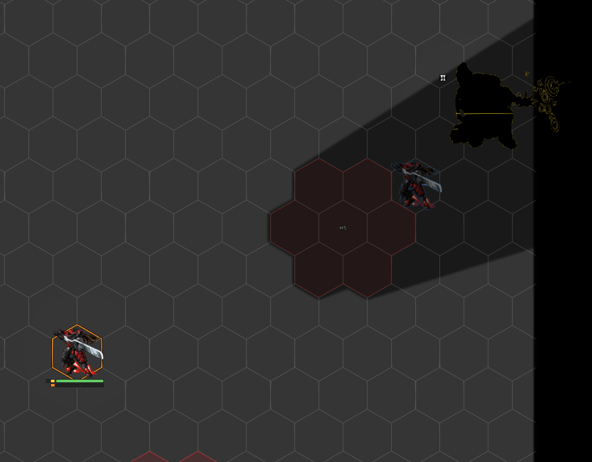

Lancer doesn't really have a concept of fog of war or vision, but personally, for immersion, I still like to play with light.

To stay within the rules, Lancer Automations gives you a way to do that: two vision modes, one for units visible on sensors and one for units seen anywhere through Battlefield Awareness.

A per-token "blocks line of sight" option (with Bulwark support, elevation-aware via Wall Height) lets units actually break sight.

There are also performance tools for light and movement, and a system that emulates Lancer's true edge-of-token line of sight (visually only).

→ Full guide: [`doc/feature/VISION.md`](feature/VISION.md)

<br clear="right"/>

---

### Wrecks

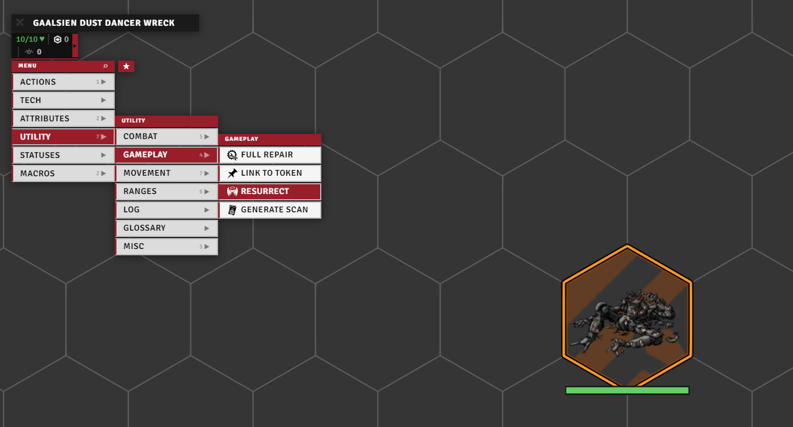

When a unit is destroyed, the module drops a dedicated wreck on the field, with per-category art, explosion, and sound, optional difficult terrain through Terrain Height Tools, and a resurrect button to bring the unit back.

Art, FX, sound, and scale can be overridden per token.

→ Full guide: [`doc/feature/WRECK.md`](feature/WRECK.md)

<br clear="right"/>

---

### Battle Log

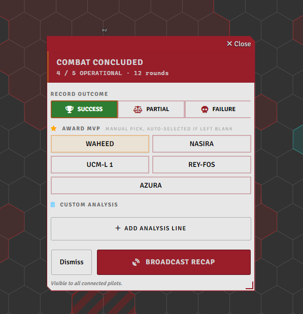

When a combat ends the module tracks the whole fight and hands you a recap, XCom-style. As GM you set the outcome and MVP on a card, then broadcast it: per-pilot stats, the enemies and who killed them, awards, and per-round telemetry charts.

→ Full guide: [`doc/feature/BATTLE_LOG.md`](feature/BATTLE_LOG.md)

<br clear="right"/>

---

### System Additions

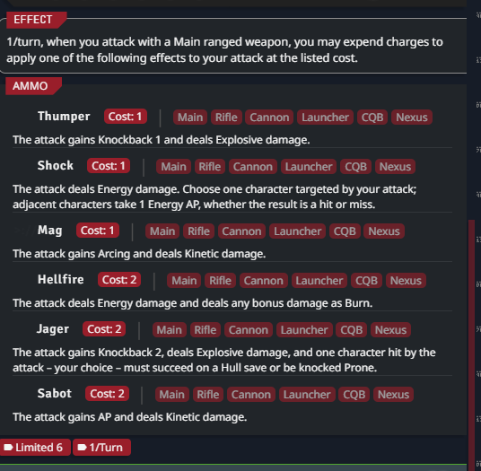

Some of the most useful things here aren't flashy, they're changes baked directly into the Lancer system and Foundry: item-disabled state for dropped or jammed gear, smoother handling of a system's ammo, extra status effects, and extra trackable attributes for token bars (Move, Reaction).

The GM setup and maintenance tools have their own guide.

→ Full guide: [`doc/feature/SYSTEM_ADDITIONS.md`](feature/SYSTEM_ADDITIONS.md) ・ setup & tools: [`doc/feature/SETUP_AND_TOOLS.md`](feature/SETUP_AND_TOOLS.md)

<br clear="right"/>

---

### Infection damage type

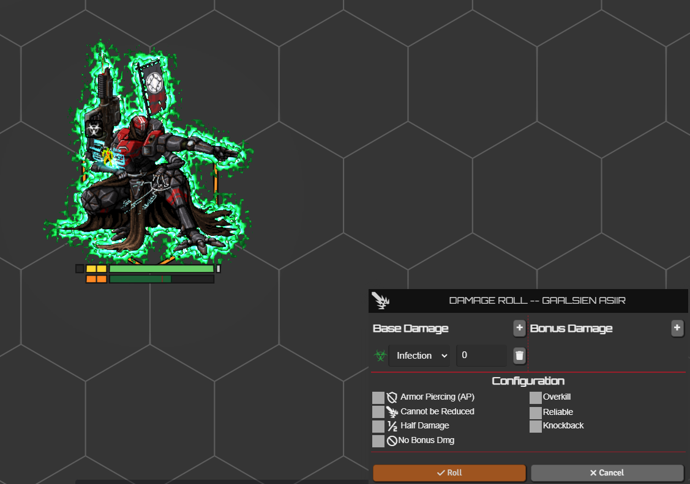

HORUS: Thy Hubris Manifest introduces an Infection damage type, and I liked it enough to wire it into Lancer properly.

It works like Burn, but for Heat, and it asks for a Systems check instead of Engineering.

You get the damage type itself, the turn-end check flow, an Infection card on the sheet, and the matching visual effects.

→ Full guide: [`doc/feature/INFECTION.md`](feature/INFECTION.md)

<br clear="right"/>

---

## Optional integrations

Lancer Automations works on its own, but a few features need or improve with these optional modules. Install details are in the tables above.

| Feature | Needs |
|---------|-------|
| Range, threat, and custom auras (HUD hover previews, `createAura` API) | Grid-Aware Auras (or my fork) |
| Difficult terrain on wrecks, 3D terrain height and line of sight | Terrain Height Tools (or my fork) |
| Elevation-aware token-blocks-line-of-sight (peek over same-height tokens) | Wall Height |
| Built-in action animations (Boost, Hide, Shut Down, Fall, Overcharge, etc.) | Lancer Weapon FX |
| Multi-team disposition matrix in activation filters | Token Factions (my fork) |
| Zone placement tools (effect, dangerous, difficult-terrain zones) | TemplateMacro |
| Syntax highlighting in the code editors | CodeMirror |
| Stack counts shown on effect icons | Status Icon Counter |

---

## Extra stuff

**Personal deployables LCP.** Some of my personal activations spawn deployables that aren't in any official LCP. Import [`extra/LaSossis_Npc_Deployables.lcp`](https://github.com/Agraael/lancer-automations/blob/main/extra/LaSossis_Npc_Deployables.lcp) if one won't resolve. See [the personal activation set](feature/AUTOMATION_ENGINE.md#the-personal-activation-set).

**Foundry movement patch (self-hosted).** On hex grids the trigger-boundary movement split can drift the resolved path from the preview. The clean fix is two source hooks. Code and locations in [Split movement at trigger boundaries](feature/MOVEMENT_ADVANCED.md#split-movement-at-trigger-boundaries).

---

## Acknowledgments

Inspiration, reference code, and ideas drawn from the work of:

- [Eranziel](https://github.com/Eranziel)
- [mandatoryhashtags](https://github.com/mandatoryhashtags)
- [caewok](https://github.com/caewok)
- [Wibble199](https://github.com/Wibble199)
- [csmcfarland](https://gitlab.com/csmcfarland)
