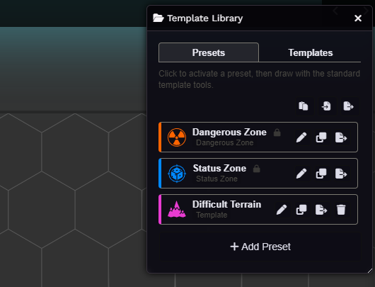
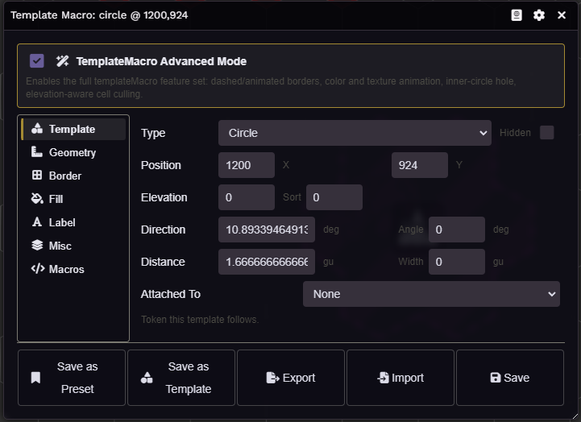
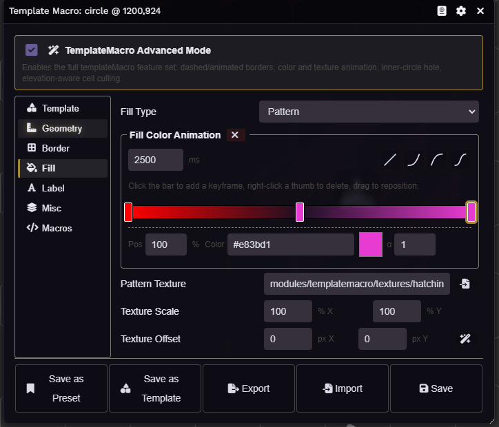
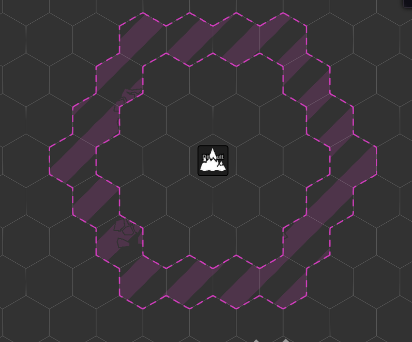
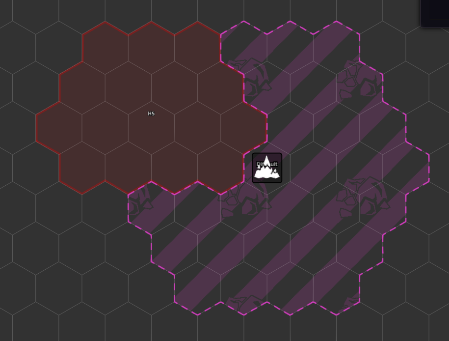
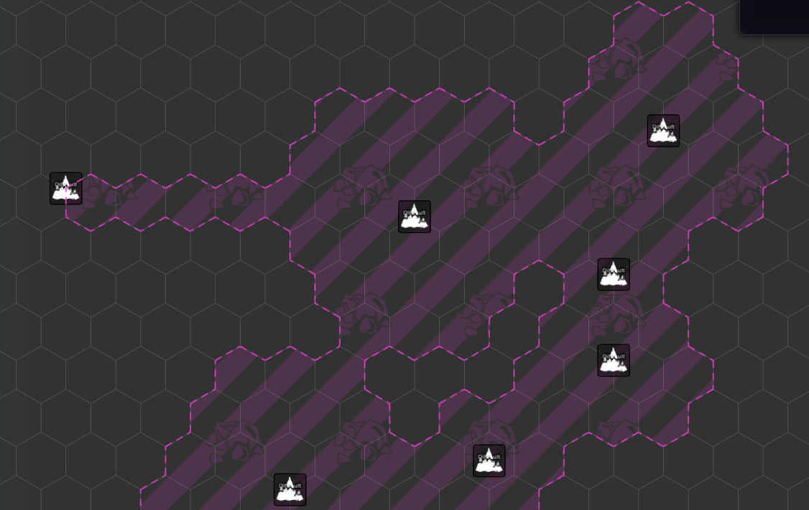
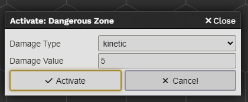
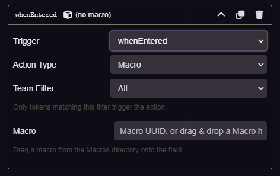

# Template Macro

[](https://github.com/Agraael/templatemacro/releases/latest)

<br/>
[)](https://github.com/Agraael/templatemacro/releases/latest)
[)](https://github.com/Agraael/templatemacro/releases/latest)

## Installation

Install via manifest URL:
```
https://github.com/Agraael/templatemacro/releases/latest/download/module.json
```

## Description

Trigger macros from events on Measured Templates:
- template lifecycle: `whenCreated`, `whenDeleted`, `whenMoved`, `whenHidden`, `whenRevealed`.
- token containment: `whenEntered`, `whenLeft`, `whenStaying`, `whenThrough`.
- combat: `whenTurnStart`, `whenTurnEnd`.

You can edit macros in two ways:
- Place a template, open its config, click the icon in the header.
- Open an item sheet, click the icon in the header to attach macros that get copied onto every template that item creates.

Inside a macro you get: `template` (the MeasuredTemplateDocument), `scene` (the parent), `token` (the moving token if relevant), and `this` for hook context.

The module exposes an API at `game.modules.get("templatemacro").api`:
- `findContainers(tokenDoc)`: template IDs that contain the token.
- `findContained(templateDoc)`: token IDs inside the template.
- `findGrids(A, B, templateDoc)`: cells between two coords that fall inside the template.
- `placeZone(options, hooks)`: place a zone with custom hooks.
- `placeZoneWithStatusEffect(options, statusEffects, hooks)`: zone that applies/removes status effects on enter/leave.
- `placeDangerousZone(options, damageType, damageValue, hooks)`: Lancer ENG-check damage zone.
- `triggerDangerousZoneFlow(token, damageType, damageValue)`: manually trigger the dangerous-zone flow.

`MeasuredTemplateDocument` gets a `.callMacro(type="never", options={})` method to fire a stored macro by name.

---

## Beyond the original module

This fork extends Template Macro with everything I wished it had when I started running Lancer. The look and the workflow are heavily inspired by **Grid Aware Auras** and **Terrain Height Tools** (Wibble199), plus my own forks of those two modules. If you use either of them you'll feel at home.

### Template Library (Presets + Templates)

A dockable side panel that lives next to the Foundry sidebar.


*The library docked next to the sidebar. Presets tab on the left, Templates tab on the right. The active preset shows the orange accent.*

Two tabs:
- **Presets**: a configured visual + macro setup you "activate", then draw with the normal Foundry measure tools. The active preset stamps its graphics and triggers onto the placed template.
- **Templates**: pre-sized templates (size + shape baked in). Click to spawn, drag to position.

Toggle the library open/close from the Measurement scene-control button. Auto-open on entering the measure control is a per-user setting.

> **Lancer only**: the **Dangerous Zone**, **Status Zone**, and **Difficult Terrain** presets are seeded only when the active game system is Lancer. On other systems the library starts empty and you build your own presets.

### Tabbed graphics sheet (V2)


*The graphics sheet. Vertical tabs on the left, content on the right. The "TemplateMacro Advanced Mode" toggle at the top gates the rendering features.*

Vertical-tab form for every templateMacro setting on a per-template or per-preset basis:

- **Template**: position, elevation, distance, attach-to-token.
- **Geometry**: radius offset.
- **Border**: solid / dashed / none, color, width, opacity, dash size/gap, dash-marching animation speed, multi-keyframe color animation editor.
- **Fill**: solid / pattern / none, color, opacity, multi-keyframe color animation, texture path + X/Y offset + offset animation + X/Y scale.
- **Label**: center label (multi-line textarea). Elevation is auto-appended as `↑N` / `↓N` when non-zero.
- **Misc**: Inner Circle (donut hole, circles only), Elevation Aware band, Elevation Ruler movement penalty.
- **Macros**: the per-trigger action list (code, macro reference, status effect apply/remove). Token target filter on each action.

### Color & texture animation


*The multi-keyframe color animation editor. Drag thumbs along the gradient track to retime keyframes, pick a color + alpha per stop, choose an easing curve.*

Multi-keyframe color animation for both border and fill. The track shows the live gradient; the playhead loops in real time. Texture offset gets a vector animation (px/s on X and Y separately). All of this is ported from my GAA fork.

### Inner Circle (donut)


*A circle template with `Inner Radius > 0` rendered as a donut. The hole is computed using Foundry's own circle cell-inclusion rule, so it sizes the same way the outer ring does on hex grids whether the origin sits on a hex center or a vertex.*

Cells inside the inner radius are culled from both rendering and `findContainers` / `findContained`, so tokens in the hole don't fire triggers. Works with merge.

### Elevation Aware


*Same template at three token elevations. Outside the vertical band, the trigger doesn't fire; THT cells where a solid usesHeight terrain rises above the band's ceiling are culled.*

Per-template toggle in the Misc tab. The vertical range defaults to `template.distance` (so the band is square-ish in 3D) but can be overridden manually. The range is `floor(value)` so `2.6` reads as `2`. Tokens outside `[template.elevation, template.elevation + floor(range)]` don't trigger.

When **Terrain Height Tools** is installed, cells where a solid `usesHeight` terrain rises above the band's ceiling get culled from both rendering and containment, mirroring GAA's polygon-cull rule at per-cell resolution.

### Visual merge


*Two same-style templates with the same center label fuse into one merged zone. Internal edges suppress; the outer boundary becomes a single dashed outline.*

Two templates merge visually iff they share a non-empty `centerLabel` AND match on the line/fill fingerprint (color, type, opacity, dash, texture). Overlapping cells render only once (no double-darkening). Shared edges drop from the border so the boundary reads as one merged shape.

### Dangerous / Status zone presets (Lancer only)


*Activating the Dangerous Zone preset prompts for the damage type + value. Same flow for Status (effect picker).*

The protected Dangerous Zone and Status Zone presets prompt for their action data at activation time. The placed template stamps the macro automatically. Duplicating a protected preset bakes the chosen action into a new editable copy.

### Drag-elevation keybindings

While dragging a template preview (or moving an existing one), press `[` / `]` to adjust elevation by 1 grid unit. Rebindable in **Configure Controls → Template Macro**.

### THT Auto-Elevation

World setting. When on, moving a template adjusts its elevation by the difference in THT terrain height between the old and new position, preserving any offset above ground.

### Default Center Label

World-level fallback string for templates with no label of their own. Default is `⚠`. Empty disables the fallback.

### Action editor


*The Macros tab's action list. Each row is a trigger + action-type (code / macro / effect) + a target filter (All / Friendly / Neutral / Hostile / per actor type / token-factions advanced team).*

Per-template actions replace the legacy one-command-per-trigger flag layout. The token target filter unifies across templateMacro, GAA, and THT, including the advanced-team support when `token-factions` is in "advanced-factions" mode.

### Live preview + clean revert

The graphics sheet pushes form changes onto the live template as you type (debounced). If you close the sheet without hitting Save, the graphics roll back to whatever was there when you opened it. Transform fields (x, y, elevation) are preserved separately: a drag-move that happens while the sheet is open doesn't get reverted on close.

### Module settings

- **Default Center Label**: fallback label shown when a template has none.
- **THT Auto Elevation**: adjust template elevation on move using THT terrain delta.
- **Auto-Open Template Library**: open the library when entering the measure scene control.

### Keybindings

- `[`: lower preview elevation by 1.
- `]`: raise preview elevation by 1.

---

## Credits

Original module by Zhell (FoundryVTT-TemplateMacro). This fork extends it heavily with patterns, helpers, and the design language borrowed from:
- **Grid Aware Auras** by Wibble199: the GAA-style vertical-tab config form, the color-animation keyframe editor, the elevation-aware terrain culling pattern.
- **Terrain Height Tools** by Wibble199: the side-panel-next-to-sidebar dock pattern, the target-filter optgroups (Token Disposition / Type / Advanced Team).
- My own forks of both modules: unified aura groups, radius offset, line glow, combat-only gates, key-press visibility modes, advanced team filters.
